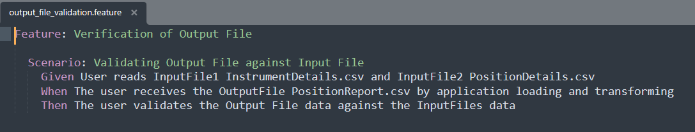
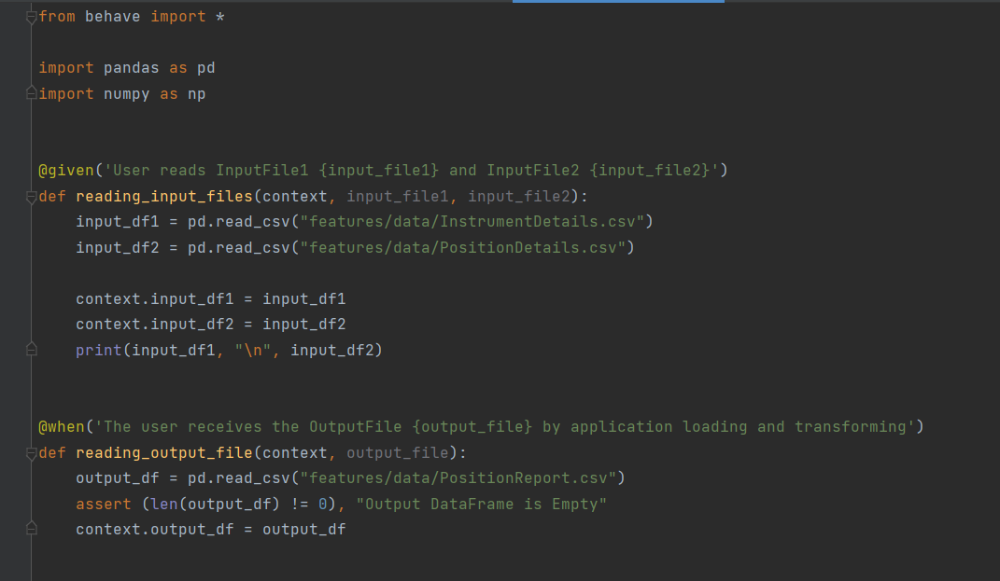
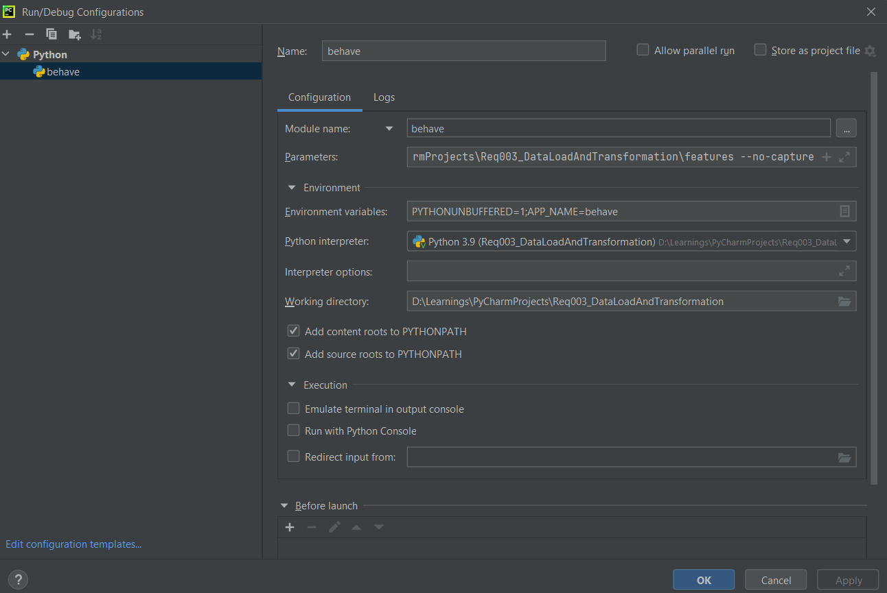
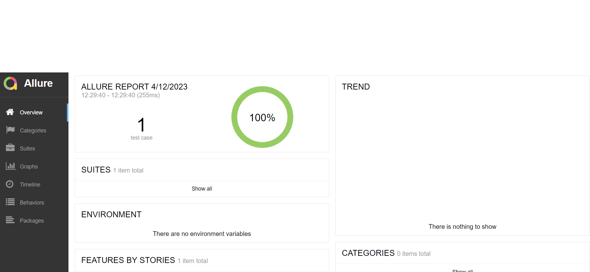

# Req003_DataLoadAndTransformation
Requirement 003 - Data Load and Transformation

Python Behave provides us a BDD(Behavior Driver Development), python style

Behavior-driven development (or BDD) is an agile software development technique that encourages collaboration between developers, QA and non-technical or business participants in a software project.

Behave uses tests written in a natural language style, backed up by Python code.

First, install *behave*. (pip install behave)

Now make a directory called "features/". In that directory create a file called "output_file_validation.feature" containing:

Make a new directory called "features/steps/". In that directory create a file called "output_file_validation.py" containing:
Every Given, When and Then should be covered

Run Behave

We can run behave with simple $behave or using the following command
<Project_Dir>\features --no-capture

Run/Debug Configurations

Allure Reports are used for Reporting

Local reports can be generated with the following command
"behave -f allure_behave.formatter:AllureFormatter -o my_allure"

Allure reports can be hosted by
"allure serve my_allure"

Allure Report

